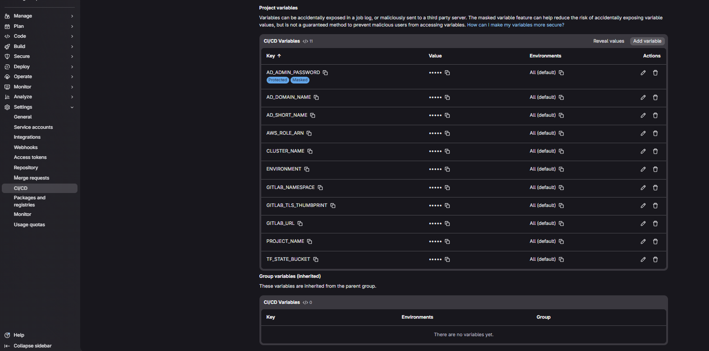
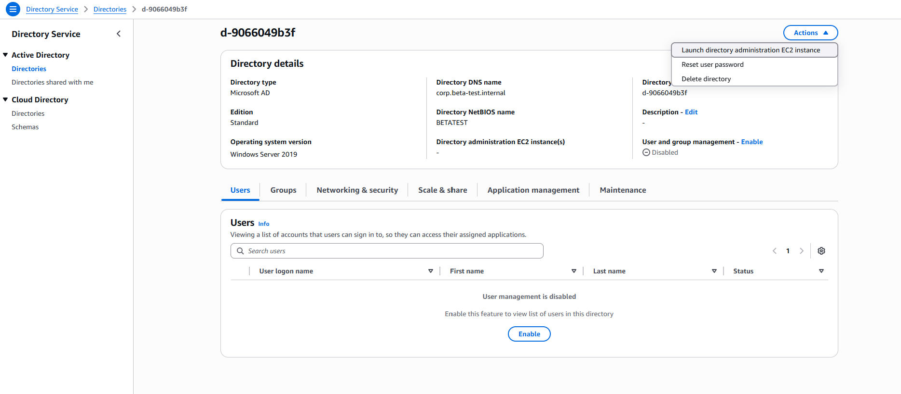

# 02 — Identity

The network exists. Three VPCs sitting there doing nothing. Now you need to figure out who gets to touch things — and make sure your CI/CD pipeline never has a hardcoded credential in it.

Jim took this one. "Two things," he said. "Managed AD for the users, and OIDC for the pipeline. Nobody gets a key to the house until we know who they are, and no key lives in a `.env` file." Sally agreed. Bob in Tampa called again. Jim also ignored it.

**What this builds:**
- AWS Managed Microsoft AD in the hub private subnets — AWS runs the domain controllers, you just point WorkSpaces at it
- DHCP options set on the hub VPC so instances resolve your AD domain
- AD admin password stored in Secrets Manager (not in your tfvars file, not in git)
- GitLab OIDC provider + IAM role — your CI pipeline assumes this role via short-lived token, no access keys anywhere

---

## Estimated Monthly Cost

| Resource | What you get | Est. $/month |
|----------|-------------|-------------|
| Managed Microsoft AD (Standard) | Two domain controllers in two AZs, up to 30K objects — plenty for 50 users | ~$40–50 |
| Secrets Manager (1 secret) | AD admin password | ~$0.40 |
| OIDC provider, IAM role | Free | $0 |
| **Layer total** | | **~$40–50/month** |

Standard Edition handles up to 30,000 directory objects — more than enough for a small shop. If you ever need to upgrade to Enterprise (500K objects, ~$110/month), change `ad_edition = "Enterprise"` in your vars and re-apply. The domain is preserved; only the underlying capacity tier changes.

> Same GovCloud pricing caveat as `01-network` — check current rates before budgeting.

---

## Before You Start

### Do you have a Git host? Read this first.

This repo is wired for **GitLab CI** with OIDC. Before you go any further, answer one question:

> *Does Vipers.io already have a GitLab instance?*

Ask someone. Seriously, just ask. There's usually a Slack message or a wiki page. If Vipers.io has been doing GovCon work for more than six months, they almost certainly have a GitLab somewhere. Use that. Point this repo at it. Done.

**If Vipers.io genuinely has no GitLab**, your options are:

| Option | Reality check |
|--------|--------------|
| **Vipers.io self-hosted GitLab in GovCloud** | The right long-term answer. Someone has to bootstrap it manually — provision the instance, install GitLab, wire up DNS — before any pipeline exists. One-time lift. After that it runs itself. |
| **GitLab Dedicated for Government** | GitLab's FedRAMP-authorized managed offering. You call GitLab, you pay GitLab a lot of money, they run it for you in a compliant environment. Good option if you don't want to operate it yourself. |

> ⚠️ **Bootstrapping a GitLab from scratch is out of scope for this repo.** If you're in that situation, get GitLab running first and come back here. We're not going to pretend that's a two-line fix.

Jim asked around at Vipers.io. Turned out there was a GitLab instance. Had been there for two years. Nobody had told the new people about it. Sally added "tell new people about the GitLab" to the onboarding doc.

---

## Gather These Values Before You Touch a Terminal

Open a notepad. You need nine values before you run a single command. Everything below tells you exactly how to get each one — add each value to your notepad as you go.

```
ad_domain_name        = ___________________________
ad_short_name         = ___________________________
ad_admin_password     = ___________________________   (keep this secret)
gitlab_url            = ___________________________
gitlab_namespace      = ___________________________
gitlab_repo           = ___________________________
gitlab_tls_thumbprint = ___________________________
project               = ___________________________   (carried over from 01-network)
tfstate_bucket        = ___________________________   (carried over from 01-network)
```

---

### `ad_domain_name` — your AD domain

This is the one value you cannot change without rebuilding from scratch. Every WorkSpace, every domain-joined machine, and every Kerberos ticket will use this name forever. Pick it carefully.

Use a subdomain of your contract's domain — not your company's domain, not the public root:

```
corp.falconpark.gov
│    │           │
│    │           └── .gov because it's a government contract
│    └── falconpark — the contract name, not the company name
└── corp — marks this as internal. keeps AD off the public root.
           vipers.io's other projects get corp.theirproject.gov —
           same pattern, no overlap.
```

Rules:
- No spaces, no underscores
- Don't use `.local` — it conflicts with mDNS
- Don't use the bare public root (`falconpark.gov`) — always add a subdomain prefix (`corp.falconpark.gov`)
- Once applied, it's permanent — changing this value destroys the directory and rebuilds it from scratch. You lose all users, all groups, all WorkSpaces. There is no rename. Pick it right the first time.

Add to your notepad: `ad_domain_name = corp.yourcontract.gov`

---

### `ad_short_name` — NetBIOS name

The old-school Windows domain prefix. Users see this when they log in: `FALCONPARK\jdoe`. Take the contract name, uppercase it, drop any hyphens if you need to stay under 15 characters.

Rules: 15 characters max, no dots, all caps by convention.

Add to your notepad: `ad_short_name = YOURCONTRACT`

---

### `ad_admin_password` — AD admin password

Pick a strong password now and write it somewhere safe (a password manager, not a sticky note). You will not type it on the command line — you'll load it into your shell environment before applying so it never touches shell history.

AWS enforces complexity. The password must be 8–64 characters and meet three of these four criteria: uppercase letter, lowercase letter, number, special character. A simple all-lowercase password will be rejected.

Write it down somewhere secure. You'll use it in Step 3.

---

### `gitlab_url` — your GitLab base URL

Just the root URL of your GitLab instance, no trailing slash.

- Self-hosted example: `https://gitlab.vipers.io`
- GitLab.com: `https://gitlab.com`

Add to your notepad: `gitlab_url = https://gitlab.vipers.io`

---

### `gitlab_namespace` — the GitLab group that owns this repo

This is the **group name**, not your username and not the repo name. In GitLab, navigate to your project. The URL looks like `https://gitlab.vipers.io/falcon-park/not-big-bang`. The part between the host and the repo name is the namespace — `falcon-park` in that example.

Add to your notepad: `gitlab_namespace = falcon-park`

---

### `gitlab_repo` — the repo name

The project name inside that group. For this repo it's `not-big-bang`.

Add to your notepad: `gitlab_repo = not-big-bang`

---

### `gitlab_tls_thumbprint` — GitLab's TLS certificate fingerprint

Run this command — replace `gitlab.vipers.io` with your actual GitLab hostname (or `gitlab.com` if you're using GitLab.com):

```bash
openssl s_client -connect gitlab.vipers.io:443 2>/dev/null \
  | openssl x509 -fingerprint -noout -sha1 \
  | sed 's/://g' | tr '[:upper:]' '[:lower:]' | cut -d= -f2
```

Copy the output — it's a 40-character hex string. That's your thumbprint. It changes when the TLS certificate renews, so re-run this if OIDC authentication suddenly breaks after working fine.

Add to your notepad: `gitlab_tls_thumbprint = abc123...`

---

### `project` and `tfstate_bucket`

These came from `01-network`. Use the same values you used there.

- `project` — your contract slug, e.g. `falcon-park`
- `tfstate_bucket` — your S3 state bucket, e.g. `falcon-park-tfstate`

---

## Still Running Locally

Jim and Sally run this layer from their laptops. The SA will run `03-workspaces` from their own terminal (same admin credentials) — that's the last local apply before CI takes over. Once both are done and you've verified the pipeline runs `04-kubernetes` cleanly, the admin access key gets deleted.

---

## Step 1 — Init

All terraform commands below run from the `terraform/02-identity/` directory.

```bash
cd terraform/02-identity
terraform init \
  -backend-config="bucket=falcon-park-tfstate"    # <---- change me to your bucket name
```

---

## Step 2 — Plan

Paste your values from the notepad into this command:

```bash
terraform plan \
  -var="project=falcon-park" \                              # <---- change me
  -var="environment=dev" \
  -var="tfstate_bucket=falcon-park-tfstate" \               # <---- change me
  -var="ad_domain_name=corp.falconpark.gov" \               # <---- change me
  -var="ad_short_name=FALCONPARK" \                         # <---- change me
  -var="gitlab_url=https://gitlab.vipers.io" \              # <---- change me
  -var="gitlab_namespace=falcon-park" \                     # <---- change me
  -var="gitlab_repo=not-big-bang" \                         # <---- change me
  -var="gitlab_tls_thumbprint=yourthumbprinthere"           # <---- change me
```

The plan should show Managed AD, a DHCP option set, an OIDC provider, an IAM role, and a Secrets Manager secret.

---

## Step 3 — Apply

**First**, load your AD admin password into the shell environment. This keeps it out of shell history and off the command line entirely:

```bash
read -s TF_VAR_ad_admin_password && export TF_VAR_ad_admin_password
# Type your password and press Enter — nothing echoes to the screen
```

**Then** apply with the same vars as the plan. Terraform picks up `TF_VAR_ad_admin_password` automatically from the environment:

```bash
terraform apply \
  -var="project=falcon-park" \                              # <---- change me
  -var="environment=dev" \
  -var="tfstate_bucket=falcon-park-tfstate" \               # <---- change me
  -var="ad_domain_name=corp.falconpark.gov" \               # <---- change me
  -var="ad_short_name=FALCONPARK" \                         # <---- change me
  -var="gitlab_url=https://gitlab.vipers.io" \              # <---- change me
  -var="gitlab_namespace=falcon-park" \                     # <---- change me
  -var="gitlab_repo=not-big-bang" \                         # <---- change me
  -var="gitlab_tls_thumbprint=yourthumbprinthere"           # <---- change me
```

Type `yes`. Managed AD takes **20-45 minutes** to provision. This is not a bug. AWS is spinning up domain controllers in two AZs. Go get coffee. Bob can wait.

---

## What Success Looks Like

```
Apply complete! Resources: 8 added, 0 changed, 0 destroyed.

Outputs:
  managed_ad_id                = "d-0abc12345"
  managed_ad_dns_ips           = toset(["10.0.10.65", "10.0.11.202"])
  managed_ad_security_group_id = "sg-0abc12345"
  gitlab_ci_role_arn           = "arn:aws-us-gov:iam::123456789012:role/falcon-park-dev-gitlab-ci"
  gitlab_oidc_provider_arn     = "arn:aws-us-gov:iam::123456789012:oidc-provider/gitlab.vipers.io"
  ad_admin_secret_arn          = "arn:aws-us-gov:secretsmanager:us-gov-west-1:123456789012:secret:falcon-park-dev/managed-ad/admin-password-xxxxxx"
```

The `gitlab_ci_role_arn` output is the value you need for the `AWS_ROLE_ARN` GitLab CI variable in the next step. Copy it exactly — it's easy to accidentally grab the OIDC provider ARN instead, which looks similar but will cause `ValidationError: Request ARN is invalid` in the pipeline.

---

## After Apply — Wire Up GitLab CI/CD Variables

Go to your GitLab project → **Settings → CI/CD → Variables** and add all of the following.

`AWS_ROLE_ARN` is the most important one — it comes directly from the `gitlab_ci_role_arn` line in your Terraform output. The full ARN is the value.

**Standard variables (Unprotected + Visible):**

| Variable | Falcon-Park example | Notes |
|----------|-------------------|-------|
| `AWS_ROLE_ARN` | `arn:aws-us-gov:iam::123456789:role/falcon-park-dev-gitlab-ci` | from `gitlab_ci_role_arn` in your Terraform output |
| `TF_STATE_BUCKET` | `falcon-park-tfstate` | your bucket name from 01-network |
| `PROJECT_NAME` | `falcon-park` | your project slug |
| `ENVIRONMENT` | `dev` | |
| `AD_DOMAIN_NAME` | `corp.falconpark.gov` | your AD FQDN |
| `AD_SHORT_NAME` | `FALCONPARK` | your NetBIOS name |
| `GITLAB_URL` | `https://gitlab.vipers.io` | your GitLab instance base URL |
| `GITLAB_NAMESPACE` | `falcon-park` | your GitLab group name |
| `GITLAB_TLS_THUMBPRINT` | `abc123...` | from the openssl command above |
| `CLUSTER_NAME` | `falcon-park-dev` | project slug + `-` + environment |

**Protected + Masked variable** (toggle "Masked" on — this must never appear in logs):

| Variable | Value |
|----------|-------|
| `AD_ADMIN_PASSWORD` | your AD admin password |

When done it should look like this:



---

## After Apply — Create Your First AD User

Bob in Tampa is the reason this whole project exists. Before `03-workspaces` can provision him a desktop, he needs to exist in Active Directory.

AWS has a native user management interface built into the Directory Service console — no EC2 instance, no RDP. For a small shop this is all you need. When you pursue an ATO you'll need to edit GPOs, which does require launching the EC2 directory administration instance — but that's a later problem. See `docs/ato-mappings.md`.



1. Go to **AWS Directory Service → Directories → your directory**
2. You'll see **"User and group management — Enable"** near the top of the page. Click **Enable**. Without this, the Users tab shows nothing and you cannot create users from the console.
3. Go to the **Users** tab → **Add user**
4. Fill in:
```
User logon name:  bjohnson    ← this is what goes in workspace_users later
First name:       Bob
Last name:        Johnson
Password:         <set a strong initial password>
```
5. **Groups — skip it.** Bob is already in Domain Users by default. That's all he needs for a WorkSpace.
6. Review and click **Create user**.

> **How many WorkSpaces will this build?** One per username in `workspace_users`. Start with `bjohnson`. Add more usernames later and re-apply — Terraform only creates the new ones, existing WorkSpaces are untouched. There's no minimum; AWS service quotas set the upper limit but a small team won't get close.

---

## After Apply — Push This Repo to Your GitLab

You cloned this repo from GitHub and have been running Terraform locally. That's fine for layers 01–03, but CI takes over at layer 04 — and CI runs off GitLab, not GitHub. You need to push this repo to your Vipers.io GitLab instance now, before you need it.

This is a one-time setup. You're adding your GitLab as a second remote so you can push to both GitHub and GitLab independently.

**1. Add your GitLab instance as a remote:**

```bash
git remote add gitlab https://gitlab.vipers.io/falcon-park/not-big-bang.git
# swap in your actual GitLab URL, group, and repo name
```

**2. Verify both remotes are there:**

```bash
git remote -v
# you should see both 'origin' (GitHub) and 'gitlab' (your GitLab)
```

**3. Push to GitLab:**

```bash
git push gitlab main
```

GitLab will prompt for your credentials if you haven't set up SSH keys. If you're on a CAC-gated GitLab instance, follow your org's SSH key or credential setup process — that's outside the scope of this repo.

> Once the repo is in GitLab, every push to `main` will trigger the CI pipeline. That pipeline is what runs `04-kubernetes` and beyond — you won't be running those layers manually from your laptop.

---

## After Apply — Test OIDC

Push a commit to any branch. The GitLab CI pipeline should trigger and authenticate with AWS via the OIDC role. If it says `Error: Could not assume role` — check that `gitlab_namespace` and `gitlab_repo` exactly match your GitLab group and project name. Case-sensitive.

---

## About That Pipeline — It's Blocked, and That's Fine

After you push the repo to GitLab the pipeline will trigger and immediately stop at `apply:network` waiting for a manual approval. **Don't click it.** You already applied layers 01 and 02 from your laptop. Clicking play would just re-run Terraform against infrastructure that already exists — harmless but unnecessary.

The manual gate is intentional. It's there so a human has to approve before Terraform touches anything. For layers 01–03 that human is you, running from your terminal. CI takes over at layer 04, and when that time comes you'll click the gate deliberately.

For now the pipeline sitting at "blocked — requires manual action" is the correct state. Move on.

---

## What's Next

Go to `03-workspaces/`. The SA applies that layer from their terminal using the same admin credentials. Once Bob has a desktop and the pipeline authenticates cleanly, you're done with local applies.

---

## Troubleshooting

Something went sideways? Paste the terminal output below, then drop this whole file into Claude or ChatGPT: *"I'm building GovCloud infrastructure with Managed AD and GitLab OIDC. Here's my error."*

---

### Paste Error Output Below

```
<paste terraform output here>
```

---

**Common issues:**

| Error | What it means | Fix |
|-------|---------------|-----|
| `InvalidClientTokenId` from STS on init or plan | Wrong AWS profile or stale credentials in environment | Run `env \| grep AWS` — if `AWS_ACCESS_KEY_ID` is set, `unset` it. Make sure `AWS_PROFILE` points to the right profile and `aws sts get-caller-identity` works before running Terraform. |
| AD creation times out | Totally normal — AWS is spinning up two domain controllers | It's still provisioning in the background. Run `terraform apply` again — it'll pick up where it left off. |
| `ValidationException: Value at 'password' failed to satisfy constraint` | AD admin password doesn't meet complexity requirements | Unset `TF_VAR_ad_admin_password`, re-run `read -s TF_VAR_ad_admin_password && export TF_VAR_ad_admin_password` with a password that has uppercase, lowercase, a number, and a special character. |
| `Error: Value for undeclared variable` on plan | Running the plan from the wrong directory | Make sure you're in `terraform/02-identity/`, not `01-network/`. |
| `Error: AccessDeniedException` on Secrets Manager | Missing IAM permissions on your local profile | Add `secretsmanager:*` to your local IAM user's permissions. |
| OIDC `Error: Could not assume role` in CI | `gitlab_namespace` or `gitlab_repo` var doesn't match exactly | Re-apply with the exact GitLab group name and repo name. Case-sensitive. |
| `Error: InvalidSubnet` on AD | `01-network` didn't apply cleanly | Run `terraform output` in `01-network/` to confirm the hub VPC subnets exist. |
| `git push` rejected: "fetch first" or "non-fast-forward" | GitLab auto-created a default README when you made the project, and your local history doesn't include it | Run `git pull gitlab main --allow-unrelated-histories --no-rebase`, resolve the conflict in README.md by keeping your local version, commit the merge, then push again. |
| `ValidationError: Request ARN is invalid` in CI pipeline | `AWS_ROLE_ARN` variable is set to the wrong ARN — the OIDC provider ARN looks similar but is different | The value must be the IAM **role** ARN from `gitlab_ci_role_arn` output, e.g. `arn:aws-us-gov:iam::123456789:role/falcon-park-dev-gitlab-ci`. Not the OIDC provider ARN. |
